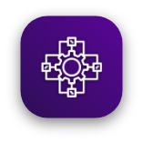
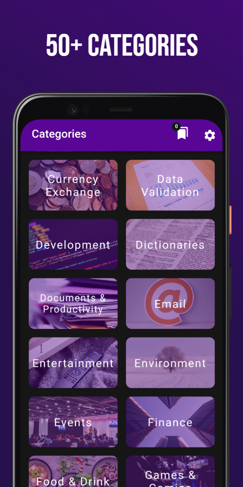
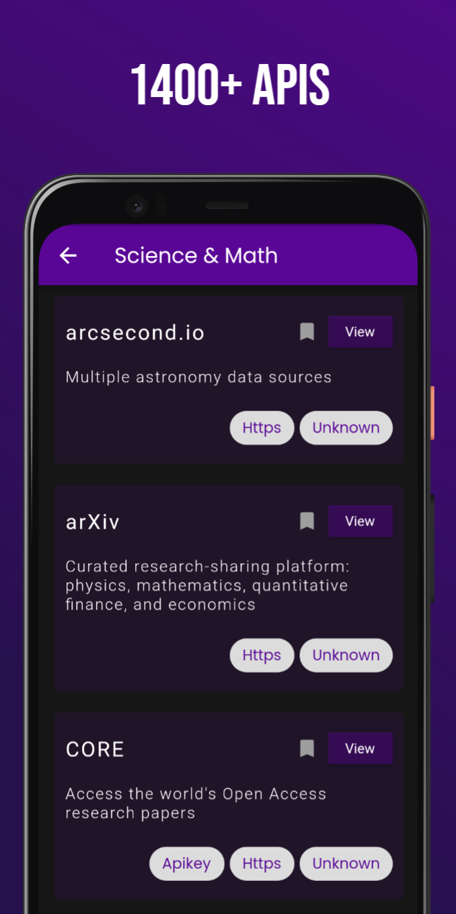
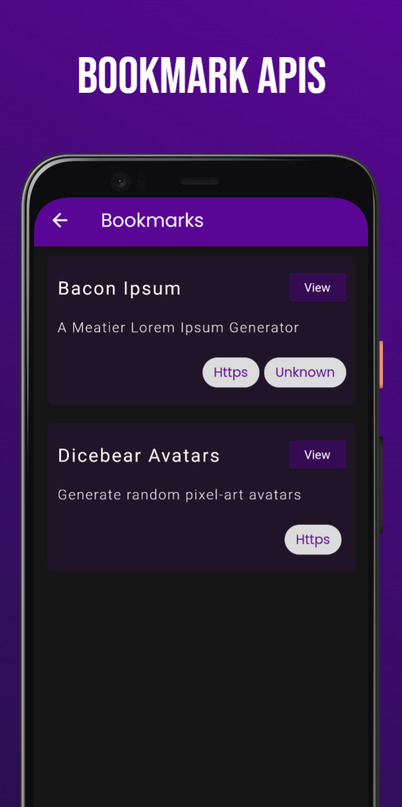
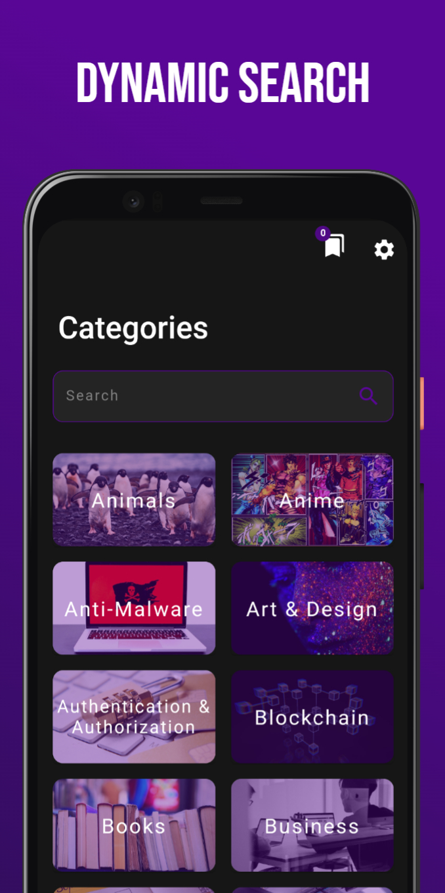
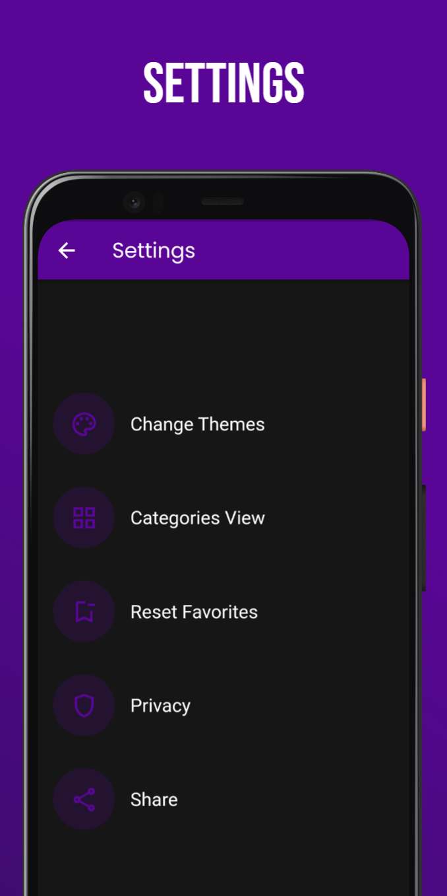
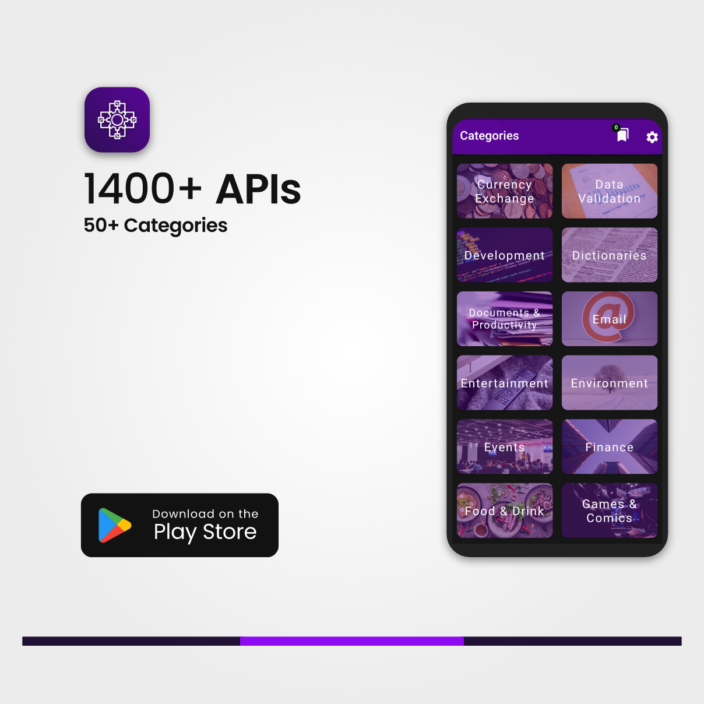

# Public APIs mobile app
Your assistant app that will help you discover and pick the next API for your next development project

## What it contains, you said?

Public Apis contains more than 1400+ free public APIs organized by 50+ categories where you can Navigate, Search, and Bookmark APIs to check them later and work on it with your projects.

## Screenshots

  
  
  
  
  
  

  
  # Download
  
  

  
  

  
  
  # Contibute
  any contributions of any type on this app is very welcome . Thanks :)
